<div align="center">

# RNCTIQ
<p align="center">

<a href="https://github.com/rnainiaa/RNCTIQ/releases/tag/v1.0.0">
    
</a>


</p>
**Cyber Investigation & Intelligence Platform**

*Trace. Correlate. Investigate.*

Transformer une adresse IP ou un nom de domaine isolé en un
**dossier d'enquête documenté, horodaté et défendable** — sans quitter une seule interface.


[English](README.en.md) · **Français**

</div>

---

## Sommaire

- [À quoi ça sert](#à-quoi-ça-sert)
- [À qui ça s'adresse](#à-qui-ça-sadresse)
- [Démarrage en 3 minutes](#démarrage-en-3-minutes)
- [Guide d'utilisation illustré](#guide-dutilisation-illustré)
  - [1. Connexion](#1-connexion)
  - [2. Tableau de bord](#2-tableau-de-bord)
  - [3. Analyser une adresse IP](#3-analyser-une-adresse-ip)
  - [4. Analyser un nom de domaine](#4-analyser-un-nom-de-domaine)
  - [5. Les empreintes : retrouver l'infrastructure](#5-les-empreintes--retrouver-linfrastructure)
  - [6. Le graphe d'investigation](#6-le-graphe-dinvestigation)
  - [7. Le dossier d'enquête](#7-le-dossier-denquête)
  - [8. La surveillance continue](#8-la-surveillance-continue)
  - [9. Les indicateurs (IOC)](#9-les-indicateurs-ioc)
  - [10. Les rapports](#10-les-rapports)
  - [11. Configuration](#11-configuration)
- [Comment lire un score de risque](#comment-lire-un-score-de-risque)
- [Mode ligne de commande](#mode-ligne-de-commande)
- [Raccourcis clavier](#raccourcis-clavier)
- [Cadre légal et déontologie](#cadre-légal-et-déontologie)
- [Questions fréquentes](#questions-fréquentes)

---

## À quoi ça sert

Vous recevez une adresse IP suspecte ou un domaine de hameçonnage. Aujourd'hui,
le caractériser suppose d'ouvrir une dizaine d'onglets — WHOIS ici, DNS là,
réputation ailleurs, certificats sur un quatrième service — puis de recopier
les résultats à la main dans un rapport.

**RNCTIQ fait tout cela en une saisie**, conserve chaque résultat horodaté, relie
les dossiers entre eux et produit le rapport final.

| Sans RNCTIQ | Avec RNCTIQ |
|---|---|
| Dix onglets, dix syntaxes, recopie manuelle | **Une saisie**, un verdict argumenté |
| « La source X dit que c'est malveillant » | **8 dimensions pondérées**, chaque indice affiché avec son poids |
| On bloque le domaine signalé, le reste survit | **Pivots par empreinte** : le cluster complet apparaît |
| Captures d'écran non horodatées | **Archivage horodaté** + chaîne de custody SHA-256 |
| Tableurs séparés, recoupement fortuit | **Détection automatique** des infrastructures communes |
| Plusieurs heures de rédaction | **Rapport PDF/HTML en une seconde** |

---

## À qui ça s'adresse

| Profil | Usage principal |
|---|---|
| **Enquêteur en cybercriminalité** | Constituer un dossier reproductible et daté, opposable devant un magistrat |
| **Analyste SOC** | Qualifier une alerte en une minute : scanner de fond, nœud TOR ou C2 réel ? |
| **Analyste Threat Intelligence** | Cartographier une infrastructure adverse au-delà de l'indicateur initial |
| **Équipe DFIR** | Extraire et qualifier en masse les indicateurs issus des journaux |

---

## Démarrage en 3 minutes

RNCTIQ est un **exécutable autonome**. Aucun Python, aucune dépendance,
aucun droit administrateur nécessaire.

```
1. Téléchargez RNCTIQ.exe depuis la section Releases
2. Placez-le dans un dossier dédié (ex. D:\Enquetes\RNCTIQ\)
3. Double-cliquez
```

> **Important** — placez le `.exe` dans un dossier où vous avez le droit
> d'écrire. Au premier lancement, RNCTIQ crée à côté de lui ses dossiers de
> travail : base de données, journaux, rapports générés. Évitez
> `C:\Program Files\` et le Bureau synchronisé sur OneDrive.

**Identifiants du premier démarrage :**

```
Utilisateur : admin
Mot de passe : ChangeMe!2024#CI
```

⚠️ **Changez ce mot de passe immédiatement** : *Sécurité → Gérer les utilisateurs*.

### Vérifier que tout va bien

```powershell
RNCTIQ.exe --check
```

Cette commande affiche l'état des dépendances, les emplacements de fichiers
utilisés et les sources disponibles. À lancer en premier en cas de doute.

### Faut-il des clés d'API ?

**Non.** RNCTIQ fonctionne immédiatement grâce aux sources publiques :
**RDAP** (registres officiels), **DNS**, **TLS** (certificat présenté par le
serveur) et **crt.sh** (Certificate Transparency).

Les clés VirusTotal, AbuseIPDB, Shodan, GreyNoise, OTX, Censys ou abuse.ch
*enrichissent* la réputation — elles ne conditionnent pas le fonctionnement.

---

## Guide d'utilisation illustré

> Toutes les captures ci-dessous proviennent de l'application réelle, exécutée
> sur des cibles publiques inoffensives (`8.8.8.8`, `iana.org`) et **sans aucune
> clé d'API**. C'est exactement ce que vous verrez à votre premier lancement.

### 1. Connexion

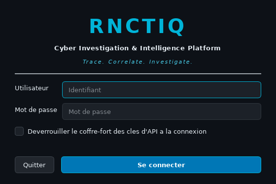

**Ce que vous voyez** — L'écran d'authentification, avec une case optionnelle
pour déverrouiller le coffre-fort de clés d'API à la connexion.

**Ce que fait cette fonctionnalité** — L'authentification n'est pas décorative :
elle conditionne la **piste d'audit**. Chaque analyse, chaque scan, chaque
export est journalisé avec l'identité de son auteur et son horodatage.

**Comment l'interpréter** — Quatre rôles encadrent les droits :

| Rôle | Droits |
|---|---|
| `admin` | Tout, y compris comptes et configuration |
| `investigator` | Dossiers, analyses, scans autorisés, rapports |
| `analyst` | Analyses et rapports — **pas de scan actif** |
| `viewer` | Consultation seule |

**Pourquoi c'est important** — En cas de contestation, la piste d'audit
démontre qui a fait quoi et quand. Elle protège l'enquêteur autant qu'elle
l'engage. La session se verrouille automatiquement après inactivité
(`Ctrl+L` pour verrouiller manuellement).

---

### 2. Tableau de bord

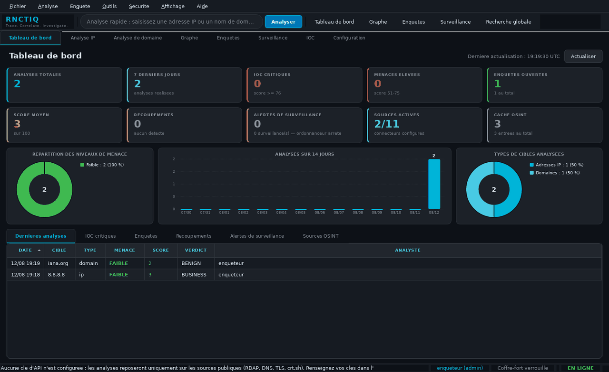

**Ce que vous voyez** — Dix indicateurs chiffrés, trois graphiques (répartition
des niveaux de menace, activité sur 14 jours, types de cibles) et le tableau des
dernières analyses avec leur verdict.

**Ce que fait cette fonctionnalité** — Elle agrège l'état de toute la base
locale : analyses conservées, IOC critiques, enquêtes ouvertes, alertes de
surveillance en attente, disponibilité des sources OSINT.

**Comment l'interpréter** — « Sources actives 2/11 » signale que seules les
sources sans clé répondent. « Recoupements 0 » indique qu'aucune infrastructure
commune n'a encore été détectée entre vos dossiers.

**Pourquoi c'est important** — C'est le point d'entrée de la journée : ce qui a
changé pendant la nuit, ce qui exige une décision, et l'état de l'outillage.

---

### 3. Analyser une adresse IP

**Comment faire** — Onglet *Analyse IP* (`Ctrl+1`), saisissez l'adresse,
cliquez sur **Analyser**.

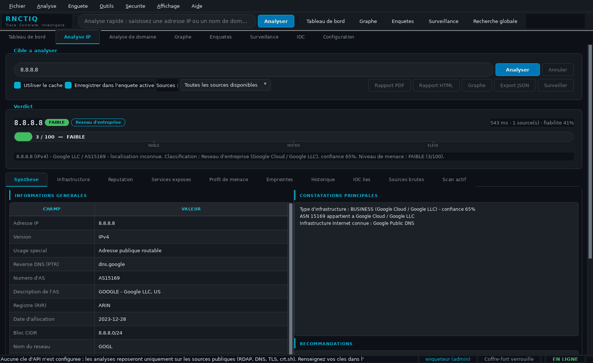

**Ce que vous voyez** — Un bandeau « Verdict » : la cible, le niveau (FAIBLE),
la classification, le score sur 100 avec sa jauge, une phrase de synthèse. En
dessous, la fiche d'identité réseau complète.

**Ce que fait cette fonctionnalité** — Elle interroge les registres RDAP, le DNS
inverse, la base GeoIP locale et les sources de réputation configurées, puis
consolide le tout.

**Comment l'interpréter** — « 1 source · fiabilité 41 % » est **aussi important
que le score** : ici une seule source a répondu. Un score faible avec une
fiabilité faible signifie « rien trouvé », **pas** « inoffensif ».

**Pourquoi c'est important** — L'ASN et le bloc CIDR identifient l'opérateur
réellement responsable — celui à qui adresser une réquisition. C'est souvent
l'information la plus actionnable de la fiche.

#### Détection VPN / proxy / TOR

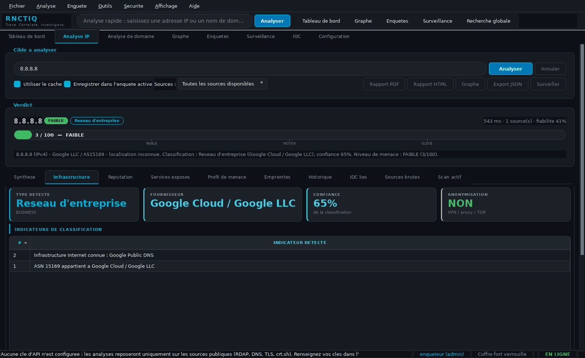

**Ce que vous voyez** — Quatre cartouches (type détecté, fournisseur, confiance,
anonymisation) puis la liste numérotée des **indices qui ont conduit au verdict**.

**Ce que fait cette fonctionnalité** — Elle classe l'adresse parmi 16 catégories
d'infrastructure : hébergeur, VPN commercial, proxy, nœud TOR, bulletproof,
réseau d'entreprise, mobile, universitaire…

**Comment l'interpréter** — La confiance compte plus que l'étiquette. À 65 %, le
faisceau est net. Sous 40 %, traitez la classification comme **une hypothèse à
vérifier**.

**Pourquoi c'est important** — Derrière un VPN, l'adresse ne désigne plus un
auteur mais **un service partagé par des milliers d'usagers**. Le savoir change
la suite de l'enquête : il faudra une réquisition, pas une déduction.

---

### 4. Analyser un nom de domaine

**Comment faire** — Onglet *Analyse de domaine* (`Ctrl+2`). Trois cases
gouvernent la profondeur : cache, énumération des sous-domaines, résolution
active.

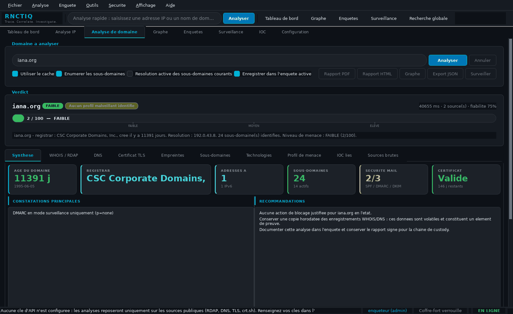

**Ce que vous voyez** — Âge du domaine, registrar, adresses A, nombre de
sous-domaines, sécurité de la messagerie et validité du certificat — puis les
constatations et recommandations.

**Ce que fait cette fonctionnalité** — Elle croise WHOIS/RDAP, tous les
enregistrements DNS, le certificat TLS et la Certificate Transparency en une
seule passe.

**Comment l'interpréter** — **L'âge est le signal le plus discriminant.**
11 391 jours désignent une institution établie. Un domaine de 3 jours qui imite
une banque est un signal d'alarme majeur.

**Pourquoi c'est important** — Les recommandations sont méthodologiques : ici,
conserver une copie horodatée des enregistrements, car ces données sont
volatiles et constituent un élément de preuve.

#### DNS et sécurité de la messagerie

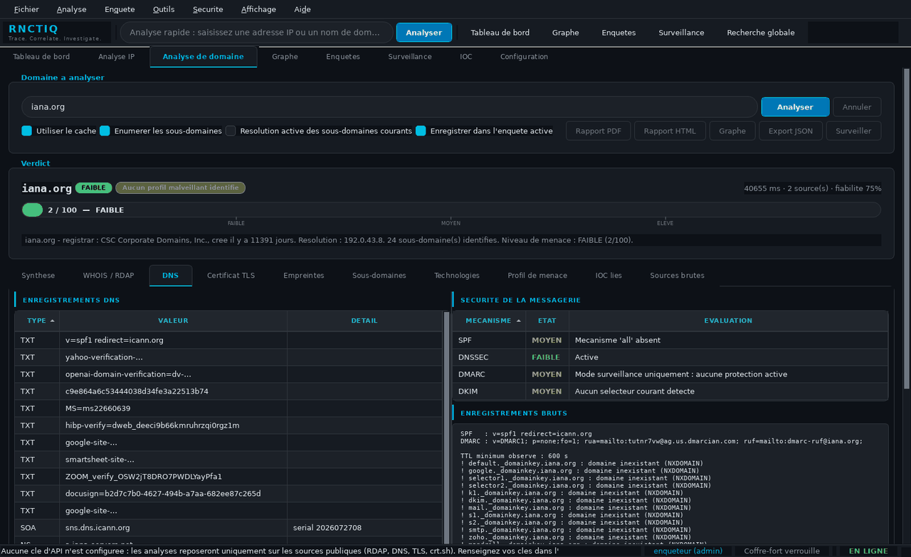

**Ce que vous voyez** — À gauche tous les enregistrements (A, AAAA, MX, TXT, NS,
SOA, CAA). À droite l'évaluation de SPF, DNSSEC, DMARC et DKIM avec un niveau de
risque par mécanisme.

**Ce que fait cette fonctionnalité** — Elle collecte la zone DNS puis **évalue la
posture anti-usurpation** : un domaine sans SPF ni DMARC peut être usurpé par
n'importe qui dans un courriel.

**Comment l'interpréter** — « DMARC en mode surveillance uniquement (p=none) »
signifie que la politique existe mais **ne bloque rien**. À signaler sans le
confondre avec une absence totale.

**Pourquoi c'est important** — Pour un SOC, c'est la réponse à « ce courriel
a-t-il pu être légitimement usurpé ? ». Pour un enquêteur, un **TTL anormalement
bas** trahit une infrastructure conçue pour bouger vite.

#### Certificat TLS

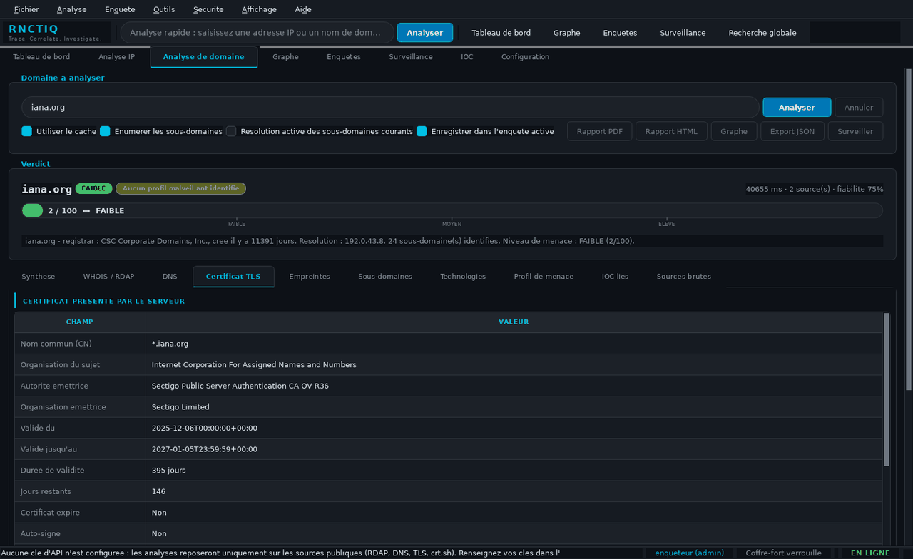

**Ce que vous voyez** — Nom commun, organisation, autorité émettrice, dates de
validité, durée, jours restants, indicateurs d'expiration et d'auto-signature.

**Ce que fait cette fonctionnalité** — Elle récupère le certificat réellement
présenté par le serveur et en extrait les noms alternatifs (SAN) et les
empreintes.

**Comment l'interpréter** — Un certificat **émis quelques heures avant les
faits**, auto-signé, ou couvrant des dizaines de domaines sans rapport, est un
signal fort.

**Pourquoi c'est important** — Le certificat est le **pivot le plus fiable** de
toute l'enquête : journalisé publiquement, horodaté par un tiers indépendant,
difficile à falsifier après coup.

#### Sous-domaines

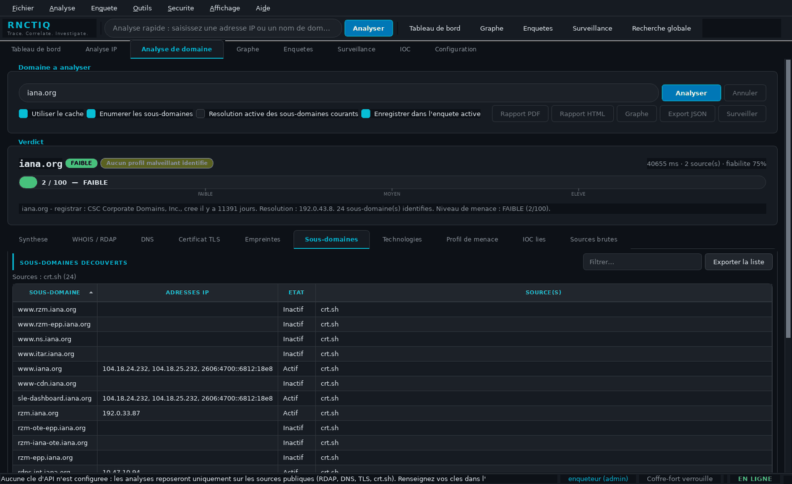

**Ce que vous voyez** — La liste des sous-domaines, leurs adresses IP résolues,
leur état (Actif / Inactif) et la source de découverte.

**Ce que fait cette fonctionnalité** — Elle interroge la Certificate
Transparency et les sources OSINT configurées. **Aucune connexion vers la cible**
n'est nécessaire : la découverte est entièrement passive.

**Comment l'interpréter** — Les **inactifs sont précieux** : ils révèlent des
noms préparés puis abandonnés — ou pas encore activés. Un
`paiement-securise.domaine` inactif annonce la phase suivante d'une campagne.

**Pourquoi c'est important** — La surface réelle d'une infrastructure dépasse
presque toujours le domaine signalé. **Bloquer le seul domaine connu laisse la
campagne opérationnelle.**

---

### 5. Les empreintes : retrouver l'infrastructure

Un criminel change d'IP en une heure et de domaine en une journée. Il change
beaucoup plus rarement de **certificat, de serveurs de noms ou de configuration
TLS**. C'est là que se trouve la continuité.

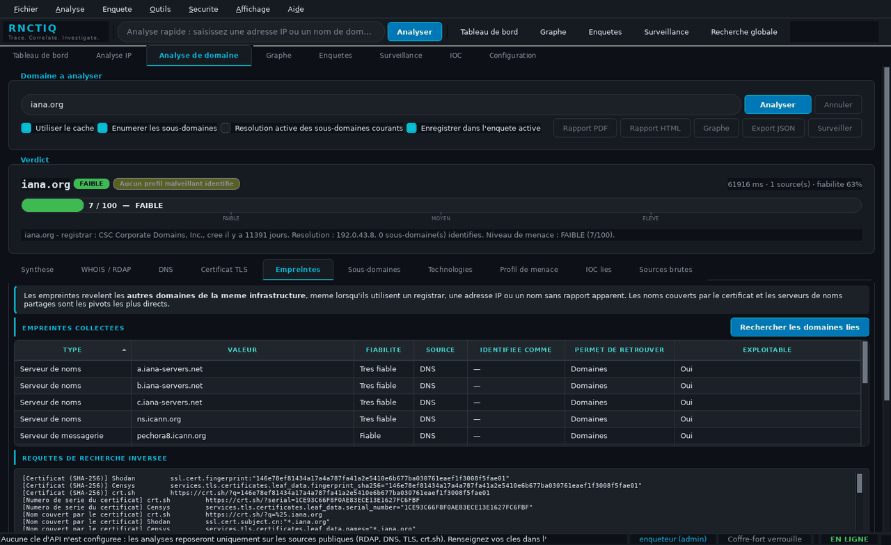

**Ce que vous voyez** — Un tableau des empreintes (type, valeur, fiabilité,
source, ce qu'elles permettent de retrouver) et, en dessous, les **requêtes
prêtes à copier** pour Shodan, Censys et crt.sh.

**Ce que fait cette fonctionnalité** — Elle extrait les éléments réutilisables
comme pivots : empreinte du certificat, numéro de série, noms couverts, serveurs
de noms, serveurs de messagerie, courriel du titulaire, JARM, hash de favicon.

**Comment l'interpréter** — La colonne **fiabilité** hiérarchise : « Très
fiable » pour un serveur de noms dédié, plus faible pour un hébergeur mutualisé
partagé par des millions de sites — où le pivot ne prouve rien.

**Pourquoi c'est important** — C'est le passage **d'un indicateur à une
infrastructure**. Le bouton « Rechercher les domaines liés » interroge crt.sh
**sans aucune clé d'API**.

---

### 6. Le graphe d'investigation

**Comment faire** — Onglet *Graphe*, choisissez la source (dernière analyse,
enquête active, ou toutes les relations), puis **Construire le graphe**.

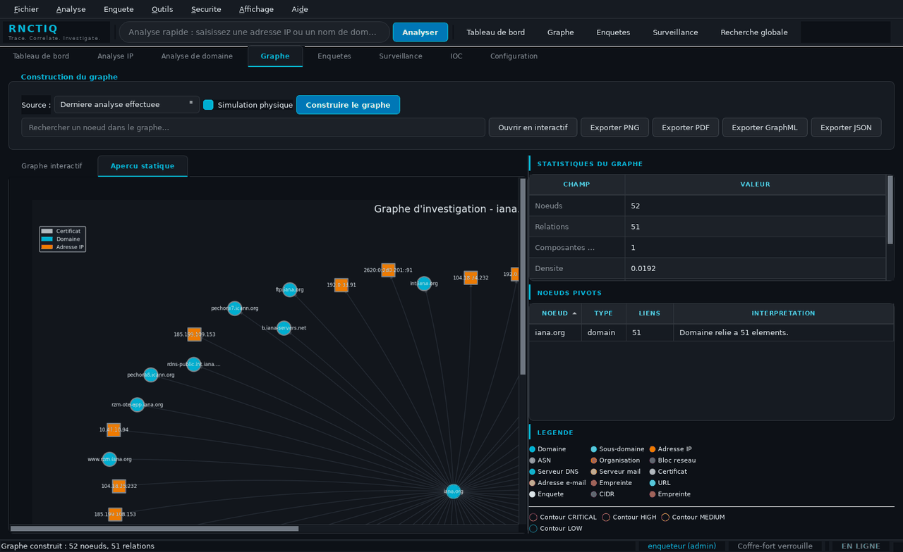

**Ce que vous voyez** — Le graphe des entités, un panneau de statistiques
(nœuds, relations, composantes, densité), la table des **nœuds pivots** avec
leur interprétation, et une légende par type et niveau de risque.

**Ce que fait cette fonctionnalité** — Elle relie domaines, sous-domaines, IP,
ASN, blocs réseau, certificats, serveurs DNS et mail, empreintes et enquêtes en
un réseau navigable.

**Comment l'interpréter** — Les nœuds pivots sont classés **par valeur
d'enquête**, non par nombre de liens : un certificat partagé par 3 domaines est
plus parlant qu'un ASN partagé par 300.

**Pourquoi c'est important** — Un tableau de 52 lignes ne se raconte pas ; un
graphe se montre. C'est **la pièce qui explique l'infrastructure** à un magistrat
ou à un comité de direction en trente secondes.

**Exports disponibles** — PNG, PDF, HTML interactif, GraphML (Gephi), JSON.

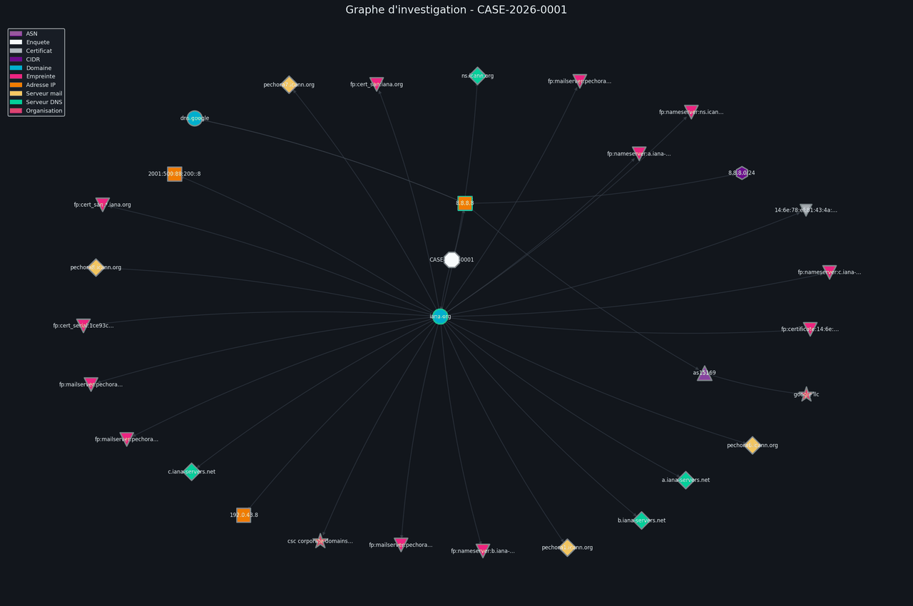

*Export PNG directement insérable dans un rapport : formes et couleurs par type
d'entité, contour par niveau de risque.*

---

### 7. Le dossier d'enquête

**Comment faire** — `Ctrl+N` pour ouvrir une enquête. Elle devient l'enquête
active : **toutes les analyses suivantes s'y rattachent automatiquement**.

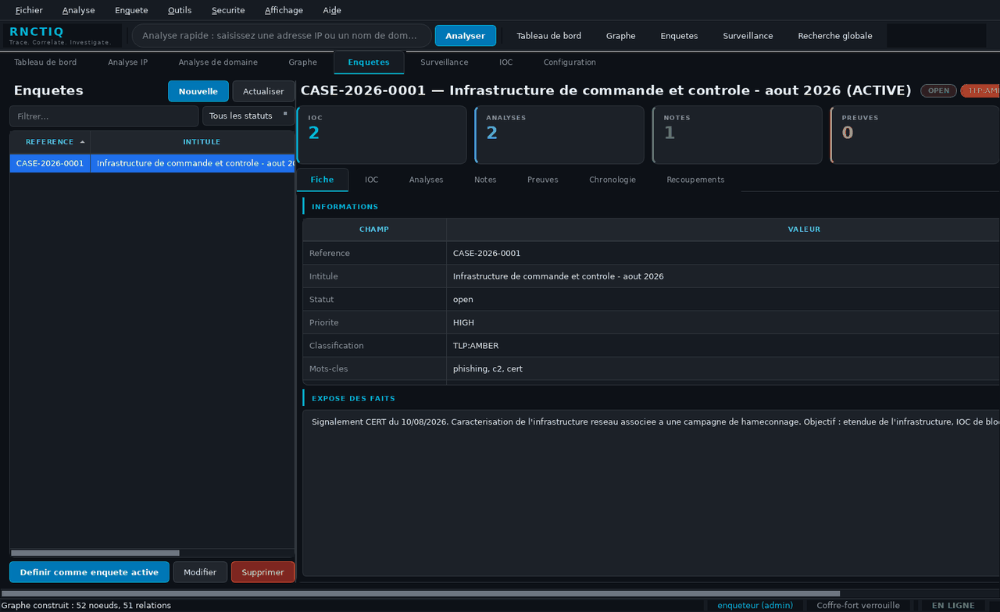

**Ce que vous voyez** — La liste des enquêtes à gauche ; à droite la référence
auto-générée, le statut, la priorité, la classification TLP, les mots-clés,
l'exposé des faits et cinq compteurs.

**Ce que fait cette fonctionnalité** — Elle agrège tout ce qui se rapporte au
dossier : indicateurs, analyses, notes, **pièces avec empreinte SHA-256**,
chronologie et recoupements.

**Comment l'interpréter** — La mention **(ACTIVE)** dans le titre indique où
seront versées vos prochaines analyses. La classification TLP gouverne la
diffusion du rapport.

**Pourquoi c'est important** — Sans dossier, une analyse est un fichier perdu.
Avec dossier, elle devient **une pièce rattachée à une procédure**, horodatée et
attribuée à son auteur.

#### Recoupements entre dossiers

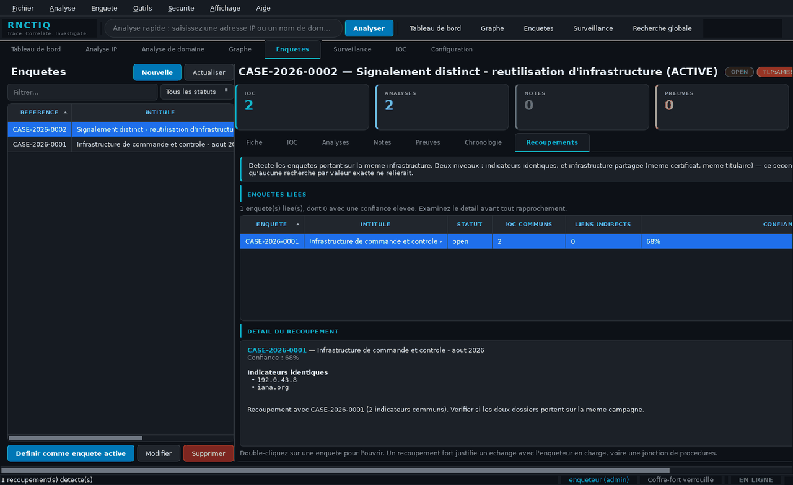

**Ce que vous voyez** — Un dossier partage une infrastructure avec un autre :
indicateurs communs, liens indirects, **niveau de confiance**, et le détail des
éléments partagés.

**Ce que fait cette fonctionnalité** — Elle compare le dossier à **tous les
autres** sur deux niveaux : les indicateurs strictement identiques, et
l'infrastructure partagée (même certificat, même titulaire, même serveur de
noms).

**Comment l'interpréter** — Le second niveau est le plus précieux : il rapproche
des dossiers **qu'aucune recherche par valeur exacte ne relierait**. Au-delà de
70 % de confiance, le rapprochement mérite un échange formel.

**Pourquoi c'est important** — C'est la réponse au cloisonnement. Deux
enquêteurs travaillant sur la même campagne sans le savoir sont mis en relation.
**Un recoupement fort peut justifier une jonction de procédures.**

#### Historisation d'une cible

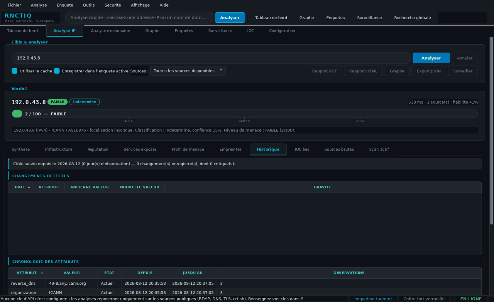

**Ce que vous voyez** — La durée de suivi, le tableau des **changements
détectés** avec leur gravité, puis la chronologie de chaque attribut : valeur,
état, période de validité, nombre d'observations.

**Ce que fait cette fonctionnalité** — À chaque analyse, l'outil compare l'état
observé au précédent et **date chaque valeur**. Il alimente aussi la dimension
« comportement » du score de risque.

**Comment l'interpréter** — Les colonnes *Depuis* et *Jusqu'au* répondent à la
question décisive : **« quel était l'état de cette infrastructure au moment des
faits ? »** — et non son état d'aujourd'hui.

**Pourquoi c'est important** — Ces données sont volatiles : **ce qui n'est pas
capturé est perdu définitivement**. Un titulaire qui change trois jours après
les faits ne s'établit que par l'historisation.

---

### 8. La surveillance continue

Elle fait passer l'outil **du réactif au proactif** : plutôt que de relancer une
analyse à la main, on déclare une cible sous surveillance et on est alerté quand
quelque chose bouge.

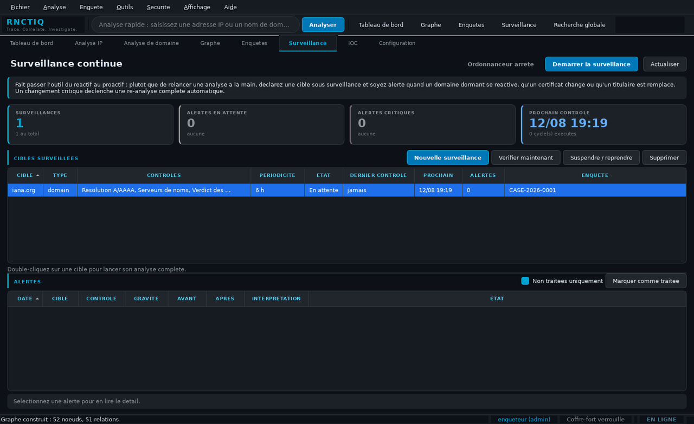

**Ce que vous voyez** — Les cibles suivies, leurs contrôles, la périodicité,
l'état, le prochain contrôle et le nombre d'alertes. En bas, le journal des
alertes.

**Ce que fait cette fonctionnalité** — **Dix points de contrôle** périodiques :
résolution A/AAAA, serveurs de noms, serveurs de messagerie, titulaire,
certificat, contenu, ports, réputation, disponibilité, DNS inverse.

**Comment l'interpréter** — Un changement classé **critique déclenche une
ré-analyse complète automatique**. Le dossier se met à jour tout seul, même si
personne ne l'a rouvert depuis des semaines.

**Pourquoi c'est important** — Sans surveillance, on apprend la réactivation
d'un domaine dormant **par la victime suivante**.

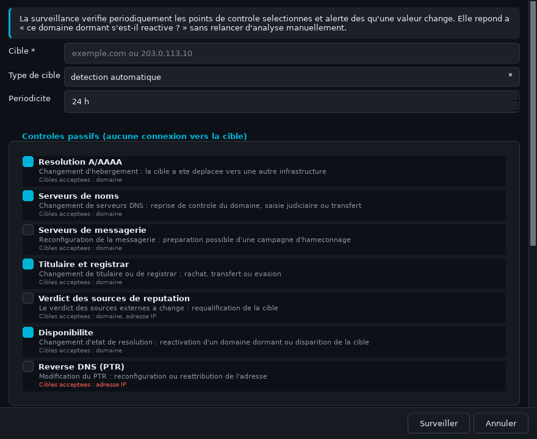

**Chaque contrôle explique ce qu'il détecte**, pas seulement ce qu'il mesure :
« changement de serveurs DNS : reprise de contrôle du domaine, saisie judiciaire
ou transfert ». L'alerte arrive déjà interprétée.

> **Passif par défaut** — les contrôles regroupés sous « contrôles passifs »
> n'établissent **aucune connexion vers la cible**. Les contrôles actifs
> (certificat, contenu, ports) sont dans une section distincte et **exigent une
> autorisation explicite**.

---

### 9. Les indicateurs (IOC)

#### Extraction automatique depuis un texte

**Comment faire** — *Outils → Extraire les IOC d'un texte…*

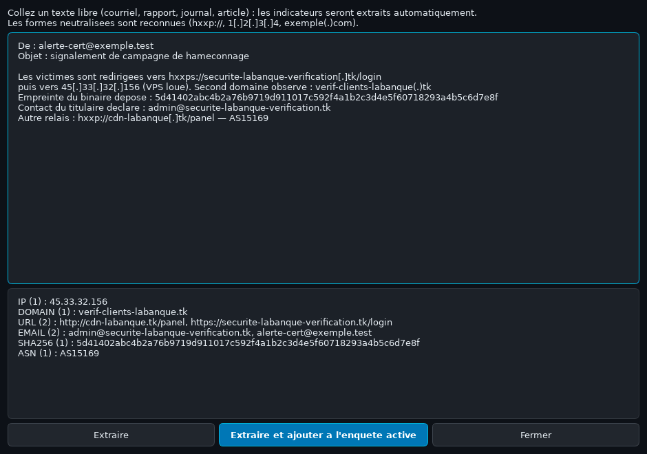

**Ce que vous voyez** — Un texte libre collé en haut (courriel, rapport,
journal) ; en bas les indicateurs extraits et typés : IP, domaines, URL,
courriels, empreintes, ASN.

**Ce que fait cette fonctionnalité** — Elle reconnaît les **formes neutralisées**
utilisées par les CERT — `hxxp://`, `1[.]2[.]3[.]4`, `exemple(.)com` — et les
remet en forme avant extraction.

**Comment l'interpréter** — Les plages de documentation (RFC 5737) et les
adresses privées sont **volontairement écartées** : elles pollueraient la base
sans jamais désigner une cible réelle.

**Pourquoi c'est important** — C'est le gain de temps le plus immédiat : un
signalement de trois pages devient une liste d'IOC qualifiés **en une
opération**, sans erreur de recopie.

#### Base d'indicateurs

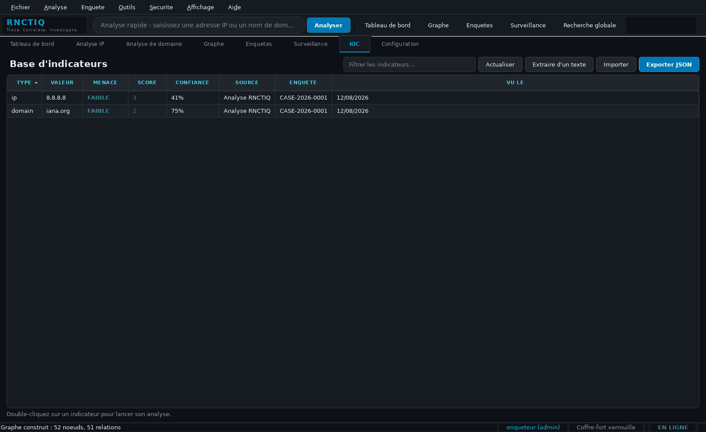

**Ce que vous voyez** — Chaque indicateur avec son type, sa valeur, son niveau
de menace, son score, sa confiance, sa source, son enquête de rattachement et sa
date d'observation.

**Ce que fait cette fonctionnalité** — Elle centralise les IOC de **toutes** les
enquêtes et permet de les exporter en JSON, CSV, **MISP**, **STIX 2.1**, règles
Suricata ou liste de blocage.

**Comment l'interpréter** — La colonne **Enquête** est le signal de recoupement :
un même indicateur présent dans deux dossiers distincts est une piste en soi.

**Pourquoi c'est important** — C'est le pont vers l'opérationnel : la liste de
blocage part au pare-feu, l'export MISP part à la communauté, **sans ressaisie**.
Un double-clic relance l'analyse de l'indicateur.

#### Recherche globale

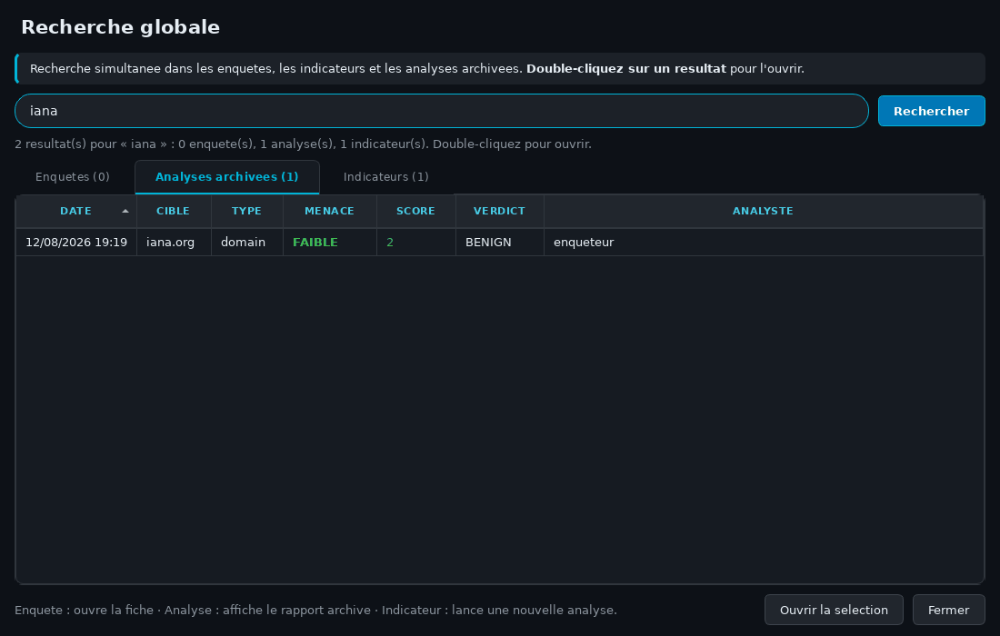

**Ce que vous voyez** — Un champ de recherche et trois onglets : Enquêtes,
Analyses archivées, Indicateurs.

**Ce que fait cette fonctionnalité** — Elle cherche dans les références, cibles,
verdicts et jusque dans le **contenu des analyses**. Un double-clic ouvre le
résultat au bon endroit.

**Comment l'interpréter** — Ouvrir une **analyse archivée** l'affiche telle
qu'elle était : l'outil ne la relance pas. Relancer produirait un résultat
différent et consommerait des quotas.

**Pourquoi c'est important** — « Est-ce qu'on a déjà vu cette IP ? » se répond
**en trois secondes** — y compris sur un dossier traité par un collègue il y a
six mois.

---

### 10. Les rapports

**Comment faire** — Depuis une analyse ou une enquête, bouton **Rapport PDF** ou
**Rapport HTML**.

<table>
<tr>
<td width="50%">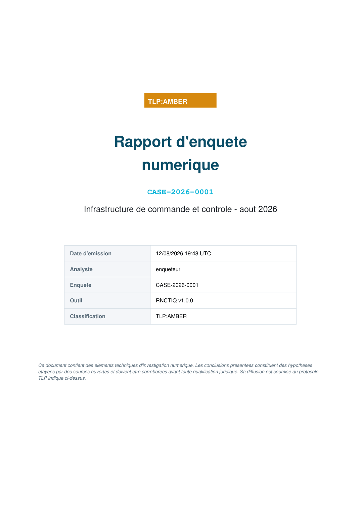</td>
<td width="50%">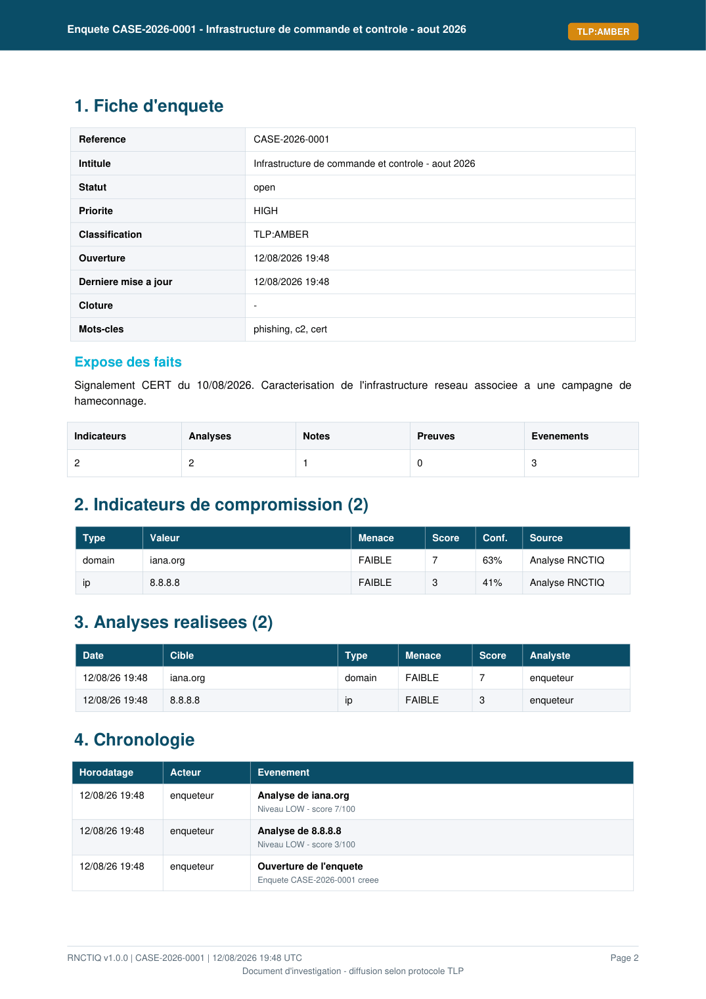</td>
</tr>
</table>

**Ce que vous voyez** — Un document paginé, en-tête et pied de page sur chaque
feuille, bandeau de classification **TLP**, sections numérotées et tableaux
normalisés.

**Ce que fait cette fonctionnalité** — Elle compose le rapport à partir de la
base : fiche d'enquête, exposé des faits, IOC, analyses, chronologie, graphe,
niveau de risque justifié et recommandations.

**Comment l'interpréter** — L'avertissement de la page de garde n'est pas une
formalité : il rappelle que les conclusions sont des **hypothèses étayées par
des sources ouvertes**, à corroborer avant toute qualification juridique.

**Pourquoi c'est important** — C'est le livrable que liront un magistrat, un
RSSI ou un client. Il est produit **en une seconde** et reste identique d'un
analyste à l'autre : la qualité ne dépend plus du rédacteur.

---

### 11. Configuration

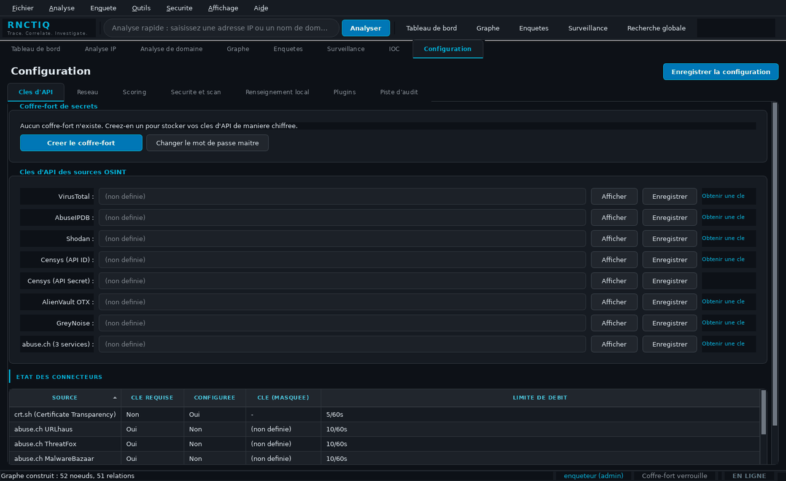

**Ce que vous voyez** — Le coffre-fort de secrets (à créer au premier
lancement), un champ par source OSINT avec un lien « Obtenir une clé », et le
tableau **État des connecteurs** : clé requise, clé configurée, limite de débit.

**Ce que fait cette fonctionnalité** — Elle centralise le paramétrage : sources,
réseau, seuils de scoring, sécurité et scan, renseignement local (bases
GeoLite2), plugins et **piste d'audit**.

**Comment l'interpréter** — `crt.sh` et RDAP affichent « clé requise : Non » —
ce sont les deux sources qui fonctionnent **immédiatement, sans compte**.

**Pourquoi c'est important** — Les clés sont stockées **chiffrées en AES**,
jamais en clair dans un fichier de configuration. La limite de débit affichée
évite de griller un quota en pleine urgence.

### Documentation intégrée

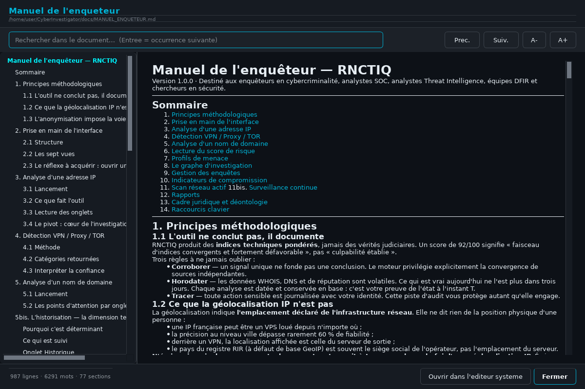

Le **Manuel de l'enquêteur** est embarqué dans l'exécutable : sommaire cliquable,
recherche plein texte, réglage de la taille du texte. Accès par *Aide → Manuel
de l'enquêteur*.

---

## Comment lire un score de risque

Le score sur 100 agrège **huit dimensions pondérées** :

| Dimension | Poids | Ce qu'elle mesure |
|---|---|---|
| Réputation | **28 %** | VirusTotal, AbuseIPDB, OTX, GreyNoise, abuse.ch |
| Infrastructure | **18 %** | VPN, proxy, bulletproof, fast-flux |
| Exposition | **14 %** | Ports ouverts, services vulnérables |
| Hygiène DNS | **9 %** | SPF, DMARC, DNSSEC |
| Âge / volatilité | **9 %** | Domaine récent, TTL bas, rotation |
| Posture TLS | **9 %** | Certificat expiré, auto-signé |
| Comportement | **8 %** | Changements observés dans le temps |
| Contexte | **5 %** | Étiquettes et listes internes |

**Seuils de lecture :**

| Score | Niveau |
|---|---|
| 0 – 25 | 🟢 Faible |
| 26 – 50 | 🟡 Moyen |
| 51 – 75 | 🟠 Élevé |
| 76 – 100 | 🔴 Critique |

Ces bornes sont **modifiables** dans *Configuration → Scoring* : une cellule
anti-fraude bancaire et un CERT n'ont pas la même tolérance.

> ⚠️ **Un score de 92/100 signifie « faisceau d'indices convergents et fortement
> défavorable », pas « culpabilité établie ».** L'outil ne conclut pas, il
> documente.

---

## Mode ligne de commande

`RNCTIQ.exe` est scriptable — utile pour l'automatisation et l'intégration SIEM.

```powershell
# Analyser une adresse IP
RNCTIQ.exe --cli ip 45.33.32.156

# Analyser un domaine et produire un rapport PDF
RNCTIQ.exe --cli domain exemple.com --report pdf

# Détection automatique du type, sortie JSON, hors ligne
RNCTIQ.exe --cli auto suspect.tk --json --offline

# Enregistrer le résultat dans un fichier
RNCTIQ.exe --cli ip 45.33.32.156 --output resultat.json

# Diagnostic de l'environnement
RNCTIQ.exe --check

# Surveillance : un cycle puis sortie (à planifier)
RNCTIQ.exe --monitor --no-gui

# Lister les surveillances enregistrées
RNCTIQ.exe --list-watches
```

### Codes de retour

| Code | Signification |
|---|---|
| `0` | Menace faible ou moyenne (score < 51) |
| `1` | Erreur d'exécution |
| `2` | Menace élevée ou critique (score ≥ 51) |

Exemple d'usage en script :

```powershell
RNCTIQ.exe --cli auto $cible --quiet
if ($LASTEXITCODE -eq 2) { Write-Host "Cible à haut risque : escalade requise" }
```

### Principales options

| Option | Effet |
|---|---|
| `--cli {ip,domain,auto}` | Analyse sans interface graphique |
| `--json` | Sortie JSON complète |
| `--output FICHIER` | Enregistre le JSON dans un fichier |
| `--report {pdf,html}` | Génère un rapport |
| `--offline` | Aucune requête réseau, cache uniquement |
| `--no-save` | N'enregistre pas en base |
| `--analyst NOM` | Nom tracé dans la piste d'audit |
| `--bruteforce` | Résolution active des sous-domaines courants |
| `--quiet` | Masque la progression |
| `--check` | Vérifie l'environnement |
| `--version` | Affiche la version |

---

## Raccourcis clavier

| Raccourci | Action |
|---|---|
| `Ctrl+1` | Aller à l'analyse IP |
| `Ctrl+2` | Aller à l'analyse de domaine |
| `Ctrl+Shift+A` | Analyse rapide (barre du haut) |
| `Ctrl+N` | Nouvelle enquête |
| `Ctrl+F` | Recherche globale |
| `Ctrl+G` | Construire le graphe |
| `Ctrl+I` | Importer des IOC |
| `Ctrl+E` | Exporter les IOC (JSON) |
| `Ctrl+S` | Enregistrer la configuration |
| `Ctrl+L` | Verrouiller la session |
| `Ctrl+Q` | Quitter |

---

## Cadre légal et déontologie

RNCTIQ applique une règle simple : **toute fonction qui établit une connexion
vers la cible est désactivée par défaut** et exige une autorisation explicite,
tracée dans la piste d'audit.

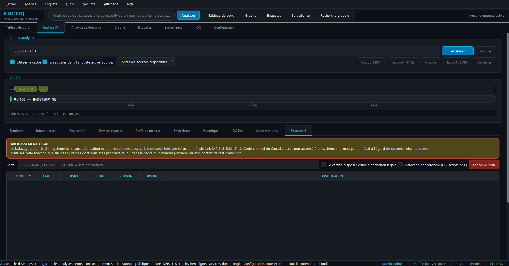

**Ce que vous voyez** — Un bandeau d'avertissement citant les textes applicables,
une case « Je certifie disposer d'une autorisation légale » et un bouton en
rouge.

**Ce que fait cette fonctionnalité** — Le scan reste **inopérant tant que la case
n'est pas cochée**. L'autorisation, son motif et l'identité de l'opérateur sont
inscrits dans la piste d'audit.

**Comment l'interpréter** — Le rouge distingue les actions **observables par la
cible** de la collecte passive, qui constitue l'essentiel de l'outil.

**Pourquoi c'est important** — En cas de contestation, la piste d'audit démontre
que l'acte a été **autorisé, motivé et attribué**.

### Ce qui est passif / ce qui est actif

| Passif — par défaut | Actif — sur autorisation |
|---|---|
| RDAP, DNS, Certificate Transparency, sources tierces | Scan de ports, JARM, favicon, TLS direct, contenu HTTP |
| Aucune trace laissée chez la cible | Observable par la cible |

### Trois rappels affichés dans l'outil

- La **géolocalisation IP** indique l'emplacement *déclaré de l'infrastructure*,
  jamais la position d'une personne.
- Derrière un **VPN**, l'adresse désigne un service partagé, pas un auteur.
- Un **score élevé** est un faisceau d'indices, pas une preuve.

> Le balayage de ports d'un système tiers sans autorisation écrite préalable est
> susceptible de constituer une infraction pénale (art. 323-1 et suivants du Code
> pénal français, Computer Misuse Act, CFAA). N'utilisez cette fonction que sur
> des systèmes dont vous êtes propriétaire, ou dans le cadre d'un mandat
> judiciaire ou d'un contrat de test d'intrusion.

---

## Questions fréquentes

<details>
<summary><b>Mes données sortent-elles de mon poste ?</b></summary>

<br>

Non. La base est **locale** (SQLite par défaut), les clés d'API sont dans un
coffre-fort **chiffré AES** sur votre machine. Les seules requêtes sortantes
sont les interrogations OSINT que **vous déclenchez** (RDAP, DNS, crt.sh, et les
sources dont vous avez configuré la clé).

Le mode `--offline` supprime toute requête réseau et travaille sur le cache.

</details>

<details>
<summary><b>Mon antivirus signale le fichier — est-ce normal ?</b></summary>

<br>

Oui, c'est un **faux positif heuristique** classique des exécutables produits
par PyInstaller : l'auto-extraction au démarrage ressemble, pour un moteur
heuristique, au comportement d'un empaqueteur malveillant.

La compression UPX est volontairement désactivée car elle aggrave nettement le
phénomène. Pour une diffusion large en entreprise, signez le binaire avec un
certificat de signature de code, ou ajoutez une exclusion sur le dossier.

</details>

<details>
<summary><b>Le premier lancement est lent — pourquoi ?</b></summary>

<br>

Un exécutable autonome se décompresse en mémoire au démarrage. Comptez quelques
secondes au premier lancement, puis c'est plus rapide. RNCTIQ crée également ses
dossiers de travail et sa base de données à la première exécution.

</details>

<details>
<summary><b>Où sont stockées mes enquêtes ?</b></summary>

<br>

Dans un dossier créé **à côté de l'exécutable**. Lancez `RNCTIQ.exe --check`
pour afficher les emplacements exacts utilisés.

Pour sauvegarder vos enquêtes, copiez le dossier `data/`. Pour repartir de zéro,
supprimez-le (l'application le recréera).

</details>

<details>
<summary><b>Puis-je l'utiliser sans clé d'API ?</b></summary>

<br>

Oui, et c'est le mode par défaut. RDAP, DNS, TLS et crt.sh couvrent l'analyse
d'infrastructure complète : identité réseau, ASN, WHOIS, enregistrements DNS,
certificats, sous-domaines et pivots.

Les clés ajoutent la **réputation multi-sources** (VirusTotal, AbuseIPDB,
GreyNoise, OTX, Shodan, Censys, abuse.ch). Toutes proposent un palier gratuit.

</details>

<details>
<summary><b>Puis-je changer les seuils de risque ?</b></summary>

<br>

Oui : *Configuration → Scoring*. Vous pouvez ajuster les bornes
faible/moyen/élevé et **la pondération des huit dimensions**. Les valeurs sont
enregistrées dans un fichier de configuration lisible.

</details>

<details>
<summary><b>Peut-on l'utiliser à plusieurs ?</b></summary>

<br>

L'exécutable est mono-poste par conception. Pour un usage en équipe, la base
peut être basculée de SQLite vers **PostgreSQL** dans la configuration : les
enquêtes, indicateurs et recoupements deviennent alors partagés, chaque analyste
gardant son compte et sa piste d'audit nominative.

</details>

<details>
<summary><b>Que faire si une analyse échoue ?</b></summary>

<br>

1. Lancez `RNCTIQ.exe --check` : il diagnostique l'environnement et les sources.
2. Vérifiez le journal dans le dossier `logs/`.
3. Certaines sources publiques (notamment `crt.sh`) renvoient des erreurs
   temporaires sous charge — l'outil réessaie automatiquement, mais une
   nouvelle tentative quelques minutes plus tard résout la plupart des cas.

</details>

---

## Pour aller plus loin

Ce README décrit l'usage de l'exécutable.
Le **Manuel de l'enquêteur** est également embarqué dans l'exécutable: 
*Aide → Manuel de l'enquêteur*.
**Exemple d'enquête complete** est également embarqué dans l'exécutable :
*Aide → Exemple d'enquête complete*.


| Document | Contenu |
|---|---|
| *Aide → Manuel de l'enquêteur* | Méthodologie, lecture des scores, pivots, cadre juridique |
| *Aide → Exemple d'enquête complete* | Cas pratique commenté de bout en bout |

<p align="center">
  <a href="https://github.com/rnainiaa/RNCTIQ/releases/tag/v1.0.0">
    
  </a>
</p>
---

<div align="center">

**RNCTIQ** · Cyber Investigation & Intelligence Platform · v1.0.0
Créateur de RNCTIQ 
Rachid Nainiaa 
M. Sc. Cyber Security 
contact@rncyber.ca 
*Les résultats produits sont des indices techniques pondérés.
Ils constituent des hypothèses à corroborer, non des vérités judiciaires.*

</div>
